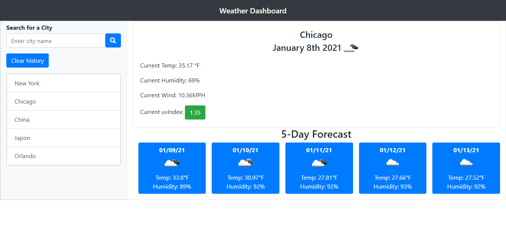

# weather_Dashboard

Using the [OpenWeather API](https://openweathermap.org/api) to retrieve weather data for cities. Using local storage you can save couple cities and keep them in your favorite list.

## User Story

```
AS A traveler
I WANT to see the weather outlook for multiple cities
SO THAT I can plan a trip accordingly
```

### Built With
----
```
  * HTML
  * Javascript
  * Bootstrap
  * Font-Awesome
  * Moment.js
```    
### How to Use
----
```
  1- Page will load history of past searches and show an input for a city.
  2- You can look for a new city or click saved cities from previous search.
  3- You can see the weather for the current city and 5 days Forecast.
```    

### Submission
---

Github Repo URL: 
[ https://github.com/v1zconde/weather_Dashboard](https://github.com/v1zconde/weather_Dashboard)

Deployed URL: [ https://v1zconde.github.io/weather_Dashboard//](https://v1zconde.github.io/weather_Dashboard/)

## Website
---
### Home Page

